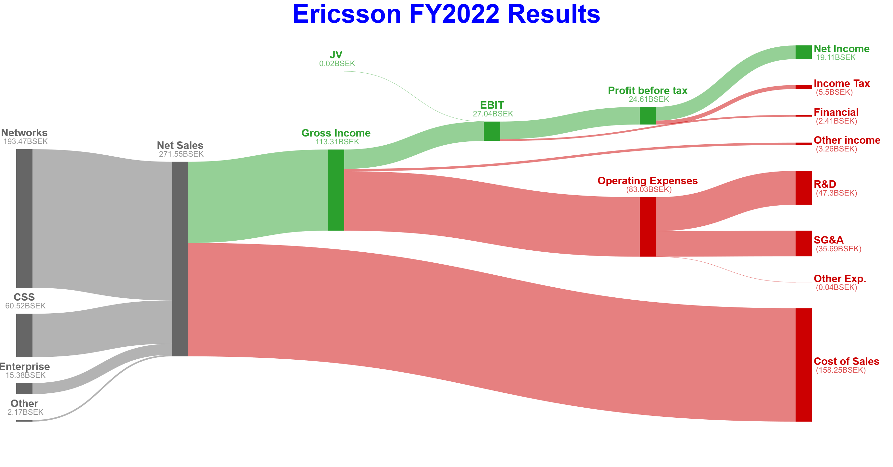
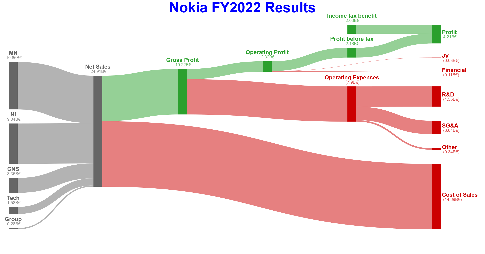

# Sankey-finance


[](https://github.com/anarion80/sankey-finance/commits/main)
[](https://github.com/anarion80/sankey-finance/releases)
[](LICENSE)

Sankey-finance is a command line utility (a wrapper around [d3-sankey](https://github.com/d3/d3-sankey)) to generate beautiful sankey charts - mostly for visualizing financial results.

It is inspired by [App Economy Insights](https://twitter.com/EconomyApp) work. It is fully Open-Source and released under MIT licence.

## :sparkles: Features
* Ability to adjust
  - node alignment (cli)
  - node sort method (cli)
  - link sort method (cli)
  - node width (cli)
  - node padding (cli)
  - node/link colors (input file)
  - chart title (input file)
  - value currency (input file)
  - value abbreviation (input file)


Example 1|Example 2
-|-
 | 

## :pencil2: Usage

If you would like to use this:
* clone the repo
* run `npm install`
* prepare input data in Excel spreadsheet file
* run `node sankey-finance.js` with desired options (see below)

You might need to experiment with node alignment and node/links sorting to create a chart that is best matching your input data.

### Input file format

The script is expecting the data to be in separate tabs (see [example input file](input.xlsx)):
#### `nodes` - with the following columns

| name | type | color |
| --- | --- | --- |
| Revenuce source | revenue | #666666 |
| Net Sales | revenue | #666666 |
| Gross Profit | proft | #2ba02d |
| Operating Expenses | loss | #cc0001 |

where:
* `name` is just the name of the node (Mandatory
* `type` is the P&L profit or loss indicator (Mandatory)
  - `profit` - used to color positive values in the P&L green
  - `loss` - used to color negative values in the P&L red and in parentheses
  - anything else won't be used for now
* `color` is the node and node name color (Optional). If not provided, the color will depend on the `type`, or some default value


#### `links` - with the following columns

| source | target | value | color |
| --- | --- | --- | -- |
| Revenuce source | Net Sales | 10 | #666666 |
| Net Sales | Gross Profit | 8 | #2ba02d |
| Net Sales | Cost of Sales | 4 | #666666 |
| Gross Profit | Operating Expenses | 2 | #cc0001 |

where:
* `source` is the name of source node (Mandatory)
* `target` is the name of target node (Mandatory
* `value` is the value of the link (Mandatory)
* `color` is the color of the link (Optional). If not provided, the color will depend on target node's `type`, or some default value


#### `metadata` - with the following columns

| header | currency | abbreviation |
| --- | --- | --- |
| Example chart title | € | B |

only one row in addition to header row
where:
* `header` - desired chart title, will be empty if not provided
* `currency` - the desired currency symbol for values, will be `€` if not provided
* `abbreviation` - the desired value abbreviation (i.e. `M` or `bln`), will be `B` if not provided

The tab presence is mandatory, but the values are optional.

### Command-line options

```
❯ node sankey-finance.js
sankey-finance.js -i input_file -o output_file -a [left|right|center|justify] -n -l -w [image_width] -h [image_height] -p [node_padding] -d [node_width]

Options:
      --help         Show help  [boolean]
      --version      Show version number  [boolean]
  -i, --input        Input Excel spreadsheet file  [string] [required]
  -o, --output       Output SVG file  [string] [default: "output.svg"]
  -a, --align        Node alignment  [string] [choices: "left", "right", "center", "justify"] [default: "justify"]
  -d, --nodewidth    Node width  [number] [default: 50]
  -p, --nodepadding  Node alignment  [number] [default: 80]
  -n, --nodesort     Node sorting  [boolean]
  -l, --linksort     Link sorting  [boolean]
  -w, --width        Image width  [number] [default: 3050]
  -h, --height       Image alignment  [number] [default: 1610]

Examples:
  sankey-finance.js -i Nokia_results.xlsx -o Nokia_results.svg -a right -n -l -d 80 -p 100 -w 1024 -h 768
```
#### `-i, --input`

Sets the Input Excel spreadsheet file. Mandatory.

#### `-o, --output`

Sets the output file name. If provided with:
  - `*.png` extension, a PNG file will be generated.
  - `*.svg` extension, an SVG file will be generated.
  - no extension, an SVG file will be generated.
Default is `output`

#### `-a, --align`

Sets the node alignment method. Default is `justify`.
See [3d-sankey](https://github.com/d3/d3-sankey#alignments) for more info.

#### `-d, --nodewidth`

Sets the node width as it will appear on the chart. Default is `50`.

#### `-p, --nodepadding`

Sets the node padding (the vertical separation between nodes at each column). Default is `80`.

#### `-n, --nodesort`

Sets the node sort method. It's a boolean flag, if specified, the order is fixed by the input in the input file. If not specified, the vertical order of nodes within each column will be determined automatically by the layout.

#### `-l, --linksort`

Sets the link sort method. It's a boolean flag, if specified, the order is fixed by the input in the input file. If not specified, the vertical order of links within each node will be determined automatically by the layout.

#### `-w, --width`

Sets the output image width.

#### `-h, --height`

Sets the output image height.
